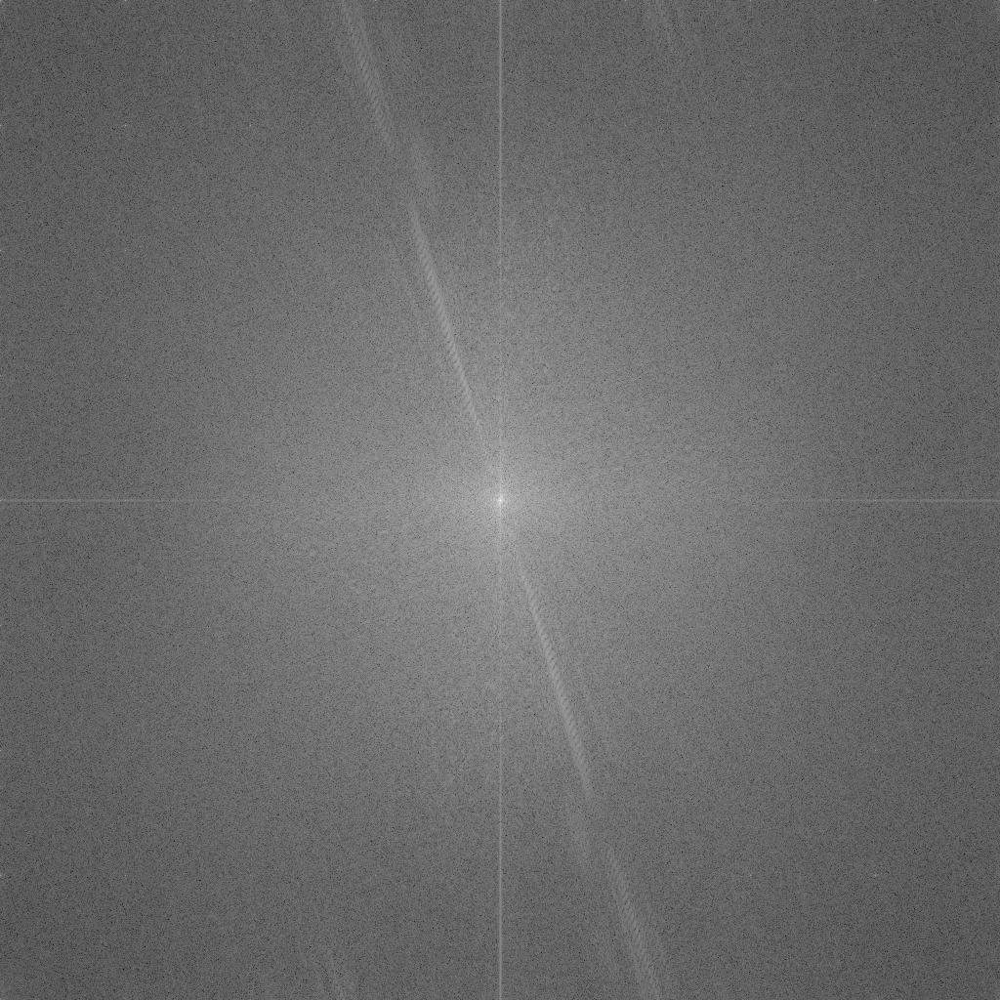
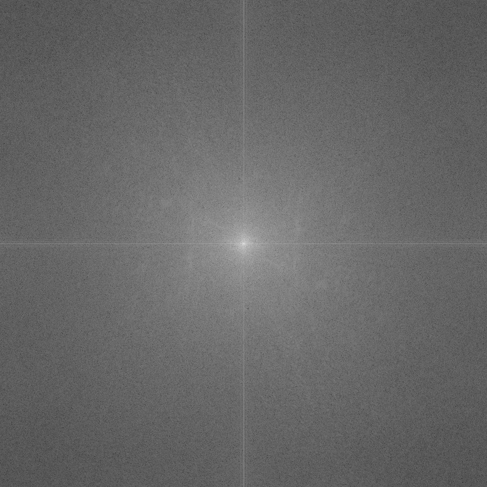

# 과제1 

자세한 코드, 명세는 [여기](https://github.com/ho4607/lecture_multi_media/tree/main/lab1)에서 확인 가능합니다.   
> 작성자 : 박성호, 융합전자공학부, 2017***883.  

## Hypothesis 
우리가 생각하는 이미지의 중요한 부분들이 phase에 들어있을 것이다. 
그리고 magnitude 성분은 low frequency 대역에 몰려 있을 것이다. 

## Work Flow
- [x] 자신이 찍은 2개의 이미지(A와 B)를 1024x1024 사이즈로 변환 후 업로드
- [x] 사진을 2D DFT를 돌린다. 그 후 magnitude 성분과 phase 성분을 구한다.
- [x] A와 B사진에서 얻은 magnitude, phase 성분을 바꾸어 inverse DFT를 한다.
- [x] phase, magnitude 가공하여 얻은 두 이미지를 원본 이미지와 비교한다.
- [x] Calculate PSNR(peak-to-peak SNR)

## Result
1. 원본 이미지를 trim 후 gray image로 변경.  
    image1 / image2.   
    

        
        .  
    

  
2. DFT 돌린후 spectrum을 구한다.   
    image 1 magnitude / image 1 phase
    
  
        
        
    
    
    image 2 magnitude / image 2 phase.    
    

        
        
    

3. A와 B사진에서 얻은 magnitude, phase 성분을 바꾸어 inverse DFT를 한다. 
    image 1 magnitude & image 2 phase. / image 2 magnitude & image 1 phase.   
    

        
        
    

4. PSNR 계산한다.  
    PSNR criterion.   
    $$(PSNR) = 20log_{10}\frac{(peak-to-peak\space value)}{{\sigma_{ms}}}$$
    Mean square criterion.  
    $$\sigma_{ms}^2 = \frac{1}{MN}\sum^M_{m=1}\sum^N_{n=1}|u(m,n)-u'(m.n)|^2$$

 - image1과 합성된 첫번째 이미지 psnr : 15.929944097297843    
 - image1과 합성된 두번째 이미지 psnr : 10.996961195527655     
 - image2와 합성된 첫번째 이미지 psnr : 10.996961195527655    
 - image2와 합성된 두번째 이미지 psnr : 12.863295536777489    
