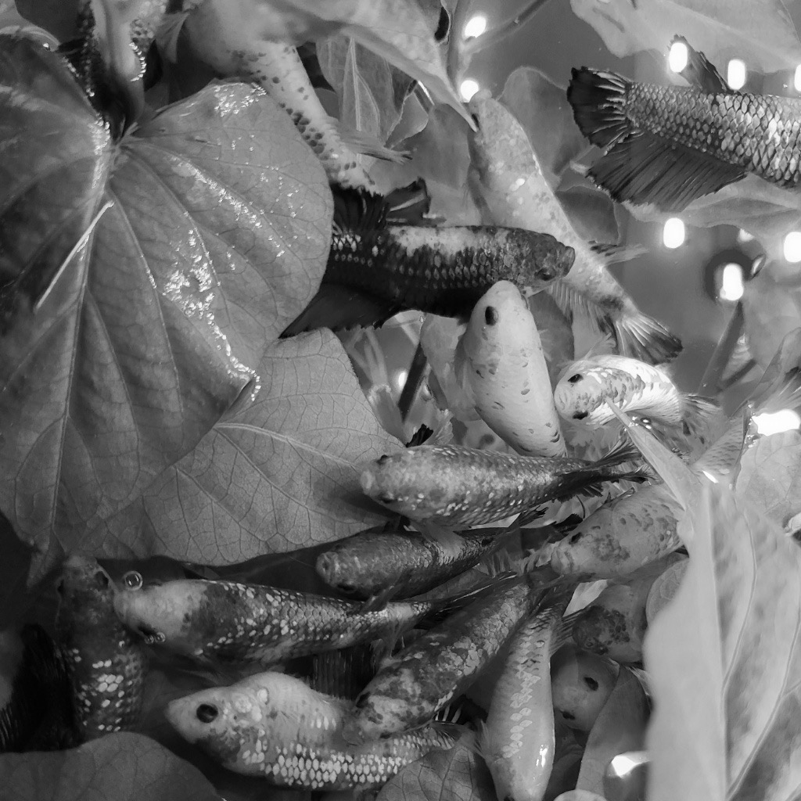
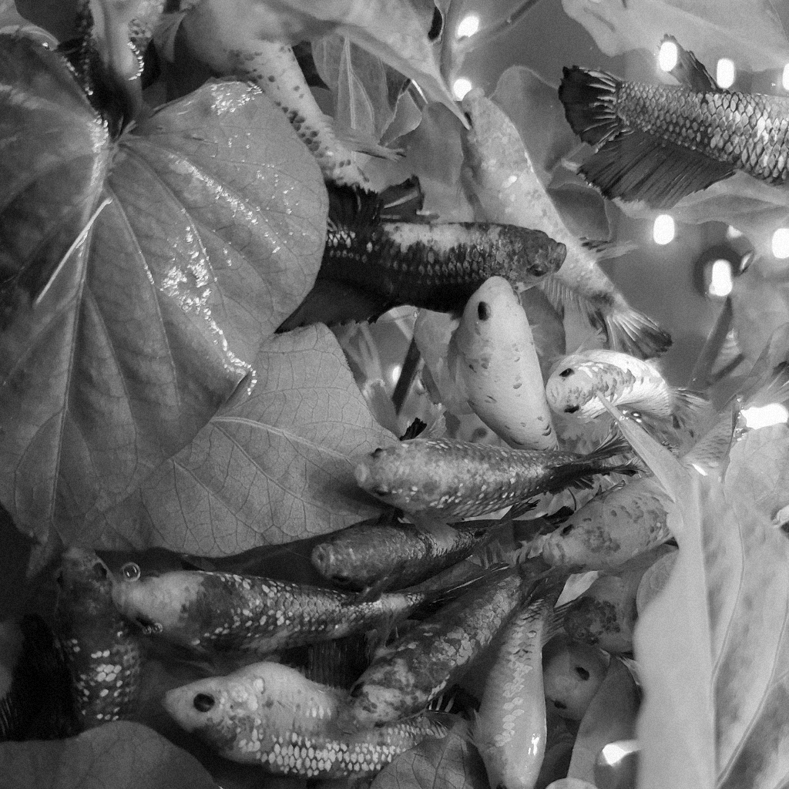

# 과제2

자세한 코드, 명세는 [여기](https://github.com/ho4607/lecture_multi_media/tree/main/lab2)에서 확인 가능합니다.   
> 작성자 : 박성호, 융합전자공학부, 2017***883.  

## Hypothesis 
1024x1024 이미지를 두개의 셋으로 나누어서 각 셋의 모든 픽셀의 합의 차는 0에 가까워질 것이다.   
1024x1024 이미지를 두개의 셋으로 나눈 각 셋에 픽셀 값에 +5 -5를 하고, 모든 픽셀의 합의 차는 구하면 10에 가까워질 것이다.
두셋을 다시 합쳐 이미지를 저장하고

## Work Flow
- [x] 1. 1024x1024 이미지를 랜덤하게 두개의 set으로 나눈다.
- [x] 2. 랜덤하게 나눈 두개의 set의 모든 원소의 합을 구한다. 그리고 그 합을 서로빼고 $$2^{19}$$으로 나눈다.
- [x] 3. 두 set에 한 쪽에는 +5의 픽셀값을 변경하고, 다른 한 쪽에는 -5의 픽셀값을 변경한 후 1~2의 과정을 다시 계산한다. (이때 0~255의 값을 넘는 픽셀은 clip 해주어야 한다.)
- [x] 4. 두 set을 다시 합쳐 새로운 이미지를 만들고 1과 다른 랜덤하게 두개의 셋으로 나눈 뒤 1~2의 과정을 계산한다.

## Result
1~2의 결과를 s1, 3의 과정을 s2, 4의 과정을 s3라고 한다면 다음과 같이 결과가 나왔다.

s1: 0.06668663024902344   
s2: 9.922290802001953   
s3: 0.0042724609375   

또 원본 이미지와 무작위로 픽셀값이 +5와 -5된 이미지도 살펴보자.   

(왼쪽) 원본이미지 (오른쪽) 픽셀값이 +5,-5된 수정된 이미지

    
    

